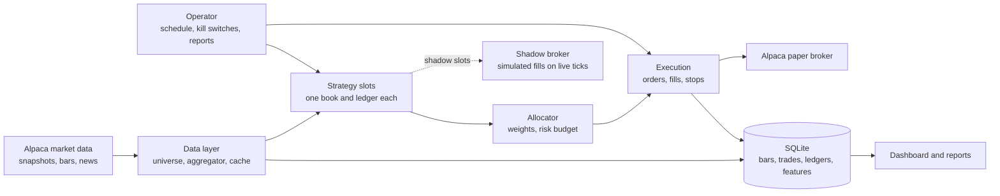

<!-- Exported from the shareable Claude doc "Ride The Wave Handbook" (last export 2026-09-23 night). Edit the doc and re-export, or edit here and mirror the change; keep the two in step. -->

# Ride The Wave Handbook

Sep 21, 2026 · Akash Venkatesan

A chapter-by-chapter reference for the Ride The Wave paper-trading quant system: what it is, how it works, every strategy with its formulae and a worked example, how strategies are tested, how risk is controlled, how it runs unattended, and what has been found so far.

## 1. What this system is

Ride The Wave is a paper-trading quant system that runs on one Mac against Alpaca's paper account, tests every strategy on up to ten years of minute data before it may trade, and runs the trading day unattended with five check-in reports. As of 21 September 2026 one strategy trades live on paper, one candidate has been tested and rejected, and the scheduled operator runs the day from 09:00 to 21:00 ET.

**The end goal** is a simulated quant trader that needs about five check-ins a day and draws on many strategies from books, papers and news, with the AI doing the research, orchestration and reporting. It does not chase low latency. Its edge, if it has one, comes from breadth of strategies and strictness of testing, not speed.

**The base strategy**, also called Ride The Wave, buys a stock after a short run of rising minute bars and sells on a pullback from the peak while keeping a minimum gain. It was built first because it is simple; it is kept because it is the reference every other strategy is compared with and because it collects live-feed data every day.

| Part | State on 21 Sep 2026 | Where to read more |
| --- | --- | --- |
| Base strategy (Wave Rider) with three entry filters | Live on paper; profit factor 1.25 on 116 backtest trades, thin but positive on both halves and on the live feed | Chapter 4 |
| Market data | Alpaca Algo Trader Plus: full US tape (SIP) in real time, unlimited streaming symbols | Chapter 3 |
| Backtester, parameter sweeps, feature dataset (446,233 rows) | Done; 62 automated tests pass | Chapters 3 and 5 |
| Multi-strategy core with shadow (incubation) mode | Done; deployed 21 Sep | Chapter 2 |
| Operator: schedule, kill switches, reports, alerts | Done; eight launchd agents installed | Chapter 7 |
| SPY intraday momentum (candidate 1) | Tested over 2,681 days and rejected | Chapter 8 |
| Opening-range breakout on stocks in play (candidate 2) | Next to build | Chapter 9 |
| Pairs, cross-sectional momentum, news via Jev | Planned | Chapter 9 |

Everything runs in Python 3.12 from a single package, stores its state in one SQLite file, and refuses to connect to the live-money endpoint. The paper account holds $100,000; the strategies are allocated $10,000 of it a day so results are easy to read as percentages.

## 2. How it works end to end

The system is five layers in a line: data comes in, strategies turn it into signals, an allocator decides how much each signal may spend, execution sends orders and tracks fills, and an operator runs the day and reports. The same strategy code runs in the backtester, in shadow mode on live prices, and live, with only the data source and the broker swapped.



Each box is a Python package under `src/ridethewave/`; the strategy box never touches the network or the database, which is what keeps backtests honest.

Since 23 September a TypeScript service (`web/`) sits beside the Python core: it reads the same database, serves a web page, and can only ask the bot to pause, resume, flatten or halt a strategy by queuing a request the bot applies on its next tick. The trading path itself stays in Python; putting a second language on it would add latency for no gain.

**One tick, every 15 seconds.** One snapshot request fetches the latest trade, quote and current minute bar for every symbol any strategy is watching (about 65 stocks plus SPY, one API call). The aggregator turns snapshots into completed one-minute bars. Each completed bar is recorded as a feature row and handed to every strategy that watches that symbol; each latest price is handed to strategies that hold it. Signals go through the strategy's order manager to its broker: the real paper broker for live slots, the shadow broker for incubating ones. In-flight orders are polled for fills, positions are written to the database, kill switches are checked, and a heartbeat is written for the reports.

**One day.** The scheduler starts the bot before the open; it waits, builds the universe (top 100 most-active stocks filtered to tradable names between $5 and $500), warms up an hour of bars, reconciles positions with the broker and starts ticking at 09:30 ET. Entries are allowed 09:31 to 11:30. At 15:55 every strategy that flattens at the close sells what it holds; at 16:00 the bot writes one ledger row per strategy, labels the day's feature rows with what happened next, and exits. Reports are written at 09:00, 11:30, 14:00, 16:15 and 21:00, a health check runs every five minutes, and a nightly job caches the day's bars.

**One strategy's life.** An idea from a book, a paper or our own data becomes a research note with a diagnostic (Chapter 5). If the data has the structure the idea needs, the strategy is written once against the strategy interface and backtested with day-level walk-forward folds. If it survives, it is added to settings in shadow mode and trades on live prices without orders until its record earns a weight. Then it goes live with an allocation, its own ledger, and the same kill switches as everything else.

| Component | Responsibility | Package |
| --- | --- | --- |
| Universe builder | Which symbols to watch today; point-in-time version for backtests | `data/universe.py`, `data/pit_universe.py` |
| Snapshot poller and aggregator | Prices in, one-minute bars out; SQLite cache of history | `data/market_data.py`, `data/bars.py` |
| Features | Per-bar features and forward labels, shared by research and live recording | `features/` |
| Strategies and registry | Pure decision code; name to factory | `strategy/` |
| Execution | Broker interface, Alpaca and shadow brokers, order manager, position book | `execution/` |
| Portfolio | Allocation, reinvestment, ledger | `portfolio/` |
| Backtest | Replay engine, simulated broker, reports | `backtest/` |
| Operator | Kill switches, reports, alerts, notifications | `operator/` |
| Runner | The live loop tying the slots together | `runner.py` |
| Dashboard | Streamlit, read-only | `ui/` |
| TypeScript API and web UI | HTTP endpoints over the same SQLite file (status, positions, trades, ledgers, reports, backtests) and a page on port 8787; queues pause, resume, flatten and halt requests the bot applies each tick | web/ (Node 26, Fastify) |

## 3. Data

All prices come from Alpaca on the Algo Trader Plus plan ($99 a month, subscribed 21 September 2026): the consolidated US tape (SIP) in real time, no hold-back on recent history, unlimited streaming symbols and 10,000 requests a minute. Before the upgrade the free plan showed only the IEX exchange, about 7% of volume on a typical name, which is why the first weeks of research were run on SIP history and checked against IEX separately.

| Source | What we take | Depth | Used for |
| --- | --- | --- | --- |
| Snapshots (one call per 200 symbols) | Latest trade, latest quote, current minute bar, daily bar | Now | Live ticks and bars |
| Minute bars | Open, high, low, close, volume, trade count, VWAP | SIP from January 2016; IEX from about 2021 | Backtests, warm-up, labels |
| Daily bars | Same fields | From 2016 | Point-in-time universe ranking |
| Screener | Top 100 most active by volume | Now | Live universe |
| Assets | Tradable flag, exchange, fractionable | Now | Universe filter |
| News (not yet wired) | Headlines with symbols and timestamps | Rolling | Sentiment filter via Jev, later |

**Bars and ticks.** Live, a bar is treated as complete when its start minute is older than the current minute; a minute with no trades produces no bar. The aggregator keeps a rolling window of 420 bars per symbol. Every request for historical bars is served from the SQLite cache when the range is already there, otherwise downloaded once and cached (about 1.6 seconds for 50 symbols for a full day). Two traps learned the hard way: the API's `limit` is a hard cap on the total returned, not a page size, so we always pass none and let the client paginate; and the API's `end` is inclusive while our cache is exclusive, so one second is trimmed.

**Universe.** Live: the 100 most-active stocks, kept if tradable, listed on NYSE, NASDAQ or ARCA, and priced between $5 and $500; typically 60 to 65 names, rebuilt every 30 minutes. For backtests a point-in-time universe ranks every tradable stock by average dollar volume over the previous 20 sessions and takes the top 50, so no day's universe uses information from after that day. Remaining bias: today's asset list omits stocks delisted since, a survivorship effect that is documented but not removed.

**Storage.** One SQLite file, `data/ridethewave.db`, write-ahead mode, the bot as the only writer. Tables: bars, orders, trades, positions, daily ledger, bot state, backtest runs, equity curves, live feature rows. Every trade, position and ledger row carries the strategy that owns it.

**Research dataset.** Built by `scripts/build_features.py` from cached SIP bars: one row per symbol per minute in the entry window, 446,233 rows over 1 June to 16 September 2026, of which 8,370 are bars the base strategy's trigger would have bought. Each row holds the features in the table below and labels for what happened next: best and worst excursion over the next 60 bars, whether +1% was hit before -1%, and the profit or loss our own exit rules would have produced from that bar.

| Feature | Definition |
| --- | --- |
| Relative volume | This bar's volume over the mean of the previous 20 bars |
| Streak volume ratio | Mean volume during the streak over the mean of the 20 bars before it |
| Trade-count ratio | Same, for number of trades; low means fewer, larger trades |
| VWAP distance | Price over the session's volume-weighted average price, minus one, in percent |
| Session return | Price over the session open, minus one |
| Noise (range) | Mean of (high minus low) over close for the previous 20 bars, in percent |
| Gain versus range | Streak gain divided by noise |
| SPY 5-minute and session return | Market context at the same minute |
| Minutes since open, streak length, streak gain | Timing and trigger strength |

**Live feature recording.** From 22 September every paper session writes the same rows for every universe stock on the live feed and labels them after the close, so the classifier can be trained and checked on the data the bot actually trades. Export with `scripts/export_live_features.py`.

## 4. Strategy catalogue

Two strategies exist in code today: Wave Rider, live on paper with three entry filters, and SPY intraday momentum, a market-timing template that failed its test and is disabled. Each entry below gives the idea, the exact rules, the formulae, one worked example with numbers, and where the evidence stands. Candidate strategies not yet built are in Chapter 9 with their formulae.

### 4.1 Wave Rider (base strategy, live)

**Idea.** A stock that has closed higher for several minutes in a row, on real volume, while the market is rising, is bought; it is sold when it pulls back a set fraction from its peak, provided that sale still locks in a minimum gain; a hard stop and a timeout cap the downside.

**Entry rules** (checked at the close of each one-minute bar, 09:31 to 11:30 ET, at most one entry per symbol per day, at most 5 open positions):

1. Streak: the last `k` closes each exceed the one before, with `k` = 3.
2. Streak gain of at least 1.0%: `g = c_t / c_{t-k} - 1`.
3. Streak volume of at least 10,000 shares.
4. Filters (Section 4.2) all pass.

```latex
\text{streak}_t = \max\{k : c_{t-j} > c_{t-j-1}\ \forall\, j = 0,\dots,k-1\}, \qquad g_t = \frac{c_t}{c_{t-k}} - 1
```

**Order.** Limit buy at ask × 1.001, quantity = floor(slot dollars / limit), slot dollars = allocation × 10%. Cancelled if unfilled after 30 seconds. A server-side stop at entry × 0.99 travels with the order so the position is protected even if the bot dies.

**Exit rules** (checked on every price update, first match wins), with `P` the peak price since entry, `E` the entry price, `p` the last price:

```latex
\text{trigger} = P\,(1 - 0.015), \qquad \text{floor} = E\,(1 + 0.005)
```

1. Wave exit: sell at market when `p <= trigger` and `trigger >= floor`. The wave exit therefore only arms once the peak is about 2.03% above entry (1.005 / 0.985).
2. Hard stop: sell when `p <= E × 0.99`.
3. Timeout: sell after 60 minutes if `p > E`; if under water, keep holding to the stop or the close.
4. Close: sell everything at 15:55 ET.

**Worked example.** Allocation $10,000, so a slot is $1,000. NVDA closes 180.00, 180.60, 181.20, 181.90 on three consecutive rising minutes at 10:05 ET: streak 3, gain 181.90 / 180.00 − 1 = 1.06%, volume 42,000 shares. SPY is up 0.25% on the day, NVDA is up 0.4%, the trade-count ratio is 0.55, so all filters pass. Limit price 181.90 × 1.001 = 182.08, quantity floor(1000 / 182.08) = 5 shares, stop at 180.26. Fill at 182.05. The price runs to 186.20 by 10:40 (peak P): trigger = 186.20 × 0.985 = 183.41, floor = 182.05 × 1.005 = 182.96, trigger is above floor so the exit is armed. At 10:52 a print of 183.35 is at or below the trigger: market sell, fill 183.30. Profit (183.30 − 182.05) × 5 = $6.25, or +0.69%. Had the price only reached 183.00, the trigger 180.26 would have been below the floor and the trade would have ended on the stop, the timeout at 11:05 if in profit, or the 15:55 flatten.

**Evidence.** Over 1 June to 16 September 2026 (75 days, point-in-time top-50 universe, full tape): with filters, 116 trades, 35% win rate, profit factor 1.25, +$168 on $10,000; positive in each half of the period (1.20 and 1.31) and on the IEX feed (1.17). Without filters, profit factor 0.84. The trigger itself carries no information on one-minute bars (Chapter 8); the filters and the asymmetric exit produce the result. Status: live on paper, thin, not proven.

### 4.2 Entry filters (part of Wave Rider)

**Idea.** Only take a streak when the market is rising, the stock has not already run, and the streak was made by fewer, larger trades than the minutes before it. Found by bucketing 8,370 candidate entries by each feature and searching gate combinations with a chronological train/test split (Chapter 5).

```latex
r^{SPY}_{sess} = \frac{p^{SPY}_t}{o^{SPY}_{09:30}} - 1 \ \ge 0.1\%, \qquad r_{sess} = \frac{p_t}{o_{09:30}} - 1 \ \le 0.6\%, \qquad \text{TCR} = \frac{\bar n_{\text{streak}}}{\bar n_{\text{prior }20}} \ \le 0.7
```

where `n` is the number of trades in a bar. **Example.** A streak of three bars with 90, 110 and 100 trades (mean 100) after twenty bars averaging 160 trades: TCR = 100 / 160 = 0.63, passes. The same streak after bars averaging 120 trades: TCR 0.83, rejected. **Evidence.** In the engine every combination with both the market gate and the trade-count gate was profitable and every one without both was not; the market gate does the most work.

### 4.3 Volatility-scaled exits (option, implemented, off)

**Idea.** Fixed percentages treat a stock that moves 0.3% a minute the same as one that moves 1.2%. Instead set trail, floor and stop as multiples of the stock's own per-minute range at entry, clamped between 0.2% and 2.0%.

```latex
\sigma_{20} = \frac{1}{20}\sum_{j=1}^{20}\frac{h_{t-j}-l_{t-j}}{c_{t-j}}, \qquad \text{trail} = 2.5\,\sigma_{20},\ \ \text{floor} = 1.0\,\sigma_{20},\ \ \text{stop} = 2.0\,\sigma_{20}
```

**Example.** A stock whose bars average 0.6% high-to-low gets a 1.5% trail, 0.6% floor and 1.2% stop; one averaging 1.2% gets 3.0%, 1.2% and 2.4%. **Evidence.** Alone, profit factor 0.95 versus 0.91 fixed; stacked on the filters it fell to 0.85 versus 1.25. Left off.

### 4.4 SPY intraday momentum (market-timing template, rejected)

**Idea** (Gao, Han, Li and Zhou, 2018): the first half-hour's return predicts the last half-hour's. Long-only version: at 15:30 buy SPY if the first half-hour was up more than 10 basis points, buy SH (the inverse ETF) if down more, sell at 15:58.

```latex
r_{first} = \frac{c_{09:59}}{o_{09:30}} - 1, \qquad r_{last} = \frac{c_{15:59}}{c_{15:29}} - 1, \qquad \text{position} = \operatorname{sign}(r_{first})\,\mathbb{1}\{|r_{first}| > 10\,\text{bp}\}
```

**Example.** SPY opens 760.00 and the 09:59 bar closes 762.28: `r_first` = +30 bp, so at 15:30 buy SPY at 761.50 and sell at 15:58 at 762.26: +10 bp before 1 bp of costs. **Evidence.** 2,681 days, 2016 to 2026: correlation −0.054, sign agreement 48.7%, every threshold loses after costs (Chapter 8). Disabled; kept as the template for one-decision-a-day strategies.

### 4.5 Fifteen-minute streak (candidate with evidence, not built)

The Wave Rider trigger counted on 15-minute bars shows what the 1-minute version lacks: after three rising 15-minute closes with at least 1% gain, the average forward return is +7.8 bp at 45 minutes, +18.4 bp at 90 and +22.0 ± 12.0 bp at 180 minutes (977 cases), positive in both halves and growing with the gain threshold. Built on 22 September (Section 4.7); the signal survives entry but the exit geometry eats it.

### 4.6 News scores via Jev (validated, not a filter)

**Idea.** Ask TypeSafe's Jev model six typed questions about each headline for a symbol (direction, positive, materiality, kind, stale, toxic) and use the answers to confirm or block entries.

```latex
\text{score}_{h,s} = \big(P(\text{up}),\ P(\text{down}),\ P(\text{positive}),\ \text{materiality} \in [0,2],\ P(\text{stale}),\ P(\text{toxic})\big)
```

**Example.** "Nvidia raises full-year guidance on data-center demand" scored P(positive) 0.85, category earnings or guidance with confidence 1.0, materiality 2.0; "5 tech stocks to watch this week" scored P(stale) 0.87 and materiality 0.04. **Evidence** (21,081 pairs, June to September 2026, $0.85 of API calls): Jev classifies consistently, but fresh positive news is followed by +0.6 bp at 180 minutes and −7 bp to the close, with 2% already in the price; streak entries with fresh positive news did worse (profit factor 0.74 against 0.88). Negative and legal news drift lower on both halves (−16 and −51 bp at 180 minutes). Decision: no news confirmer; a down-or-legal exclusion is cheap but changes little; daily headlines keep being scored so the analyst-note and post-earnings pockets can be re-tested with more data.

### 4.7 Wave Rider on 15-minute bars (shadow, observation only)

**Idea.** The same rules as 4.1 on 15-minute bars, where the diagnostic found the only streak-level signal. The engine rolls 1-minute bars into 15-minute buckets per strategy, anchored at 09:30 ET; ticks still drive exits. Streak 3, gain ≥ 1%, entries 09:30 to 11:30, hold up to 180 minutes, floor 0.5%, trail 1%, stop 2%, market gate on.

```latex
\text{bucket}(t) = 09{:}30 + 15\,\Big\lfloor \frac{t - 09{:}30}{15} \Big\rfloor \text{ minutes}, \qquad \text{streak counted over bucket closes}
```

**Example.** Closes of the 09:30, 09:45 and 10:00 buckets at 100.10, 100.60 and 101.30 (three rising, +1.2%): buy at the 10:15 bar's first minute; hold up to 13:15; stop at 99.27; the wave exit arms once the peak is 1.5% above entry. **Evidence** (June to September 2026): without filters profit factor 0.89 on 468 trades; with the market gate 1.00 on 122 trades, break-even. Timeouts win 93% of the time at +1.2%; stops lose 1.9% each because they fill on gaps. Runs in shadow as observation only.

### 4.8 Opening-range breakout on stocks in play (shadow, observation only)

**Idea** (Zarattini, Aziz and Barbon, 2024, long side only). A stock whose first 15 minutes trade at least three times their normal volume is in play; buy the first close above that range; stop 0.1 average true ranges below entry; risk 1% of the allocation per trade; sell at the stop or at 15:55.

```latex
\text{in play: } V_{\text{range}} \ge 3\,\bar V_{14}\,\tfrac{15}{390}, \qquad \text{entry: } c_t > H_{\text{range}}, \qquad \text{stop} = \text{entry} - 0.1\,\mathrm{ATR}_{14}, \qquad q = \frac{0.01\,A}{\text{entry} - \text{stop}}
```

**Example.** Fourteen-day average volume 20 million shares, so 15 normal minutes are 770,000; the first 15 minutes trade 2.8 million (3.6x) with a high of 50.60 and ATR 1.50. A close at 50.65 buys; stop 50.50; on a $5,000 allocation the 1% risk is $50, so 333 shares, capped by the slot to 98. **Evidence:** the 22 September figure (profit factor 0.93 on 253 trades) was computed with the global 1% stop, because the strategy's stop hook never reached the broker; with the intended ATR stop the profit factor is 0.74 at 0.1 ATR and 0.91 at 0.25 ATR (230 trades, 33% win, the 100 trades that reached the close averaged +1.7%). The shadow slot uses 0.25 ATR from 24 September. The published edge draws on the whole market and the short side; both are open items. Runs in shadow as observation only.

### 4.9 Cross-sectional day trades from *151 Trading Strategies* (shadow)

**Idea** (Kakushadze and Serur 2018, sections 3.9 and 3.20 and Appendix A). Rank the whole universe against itself once a day and buy the top of the ranking from the open to the close. Three scores, each a log return with the universe average removed so a market-wide gap cancels: overnight reversal (buy the names that fell most overnight relative to peers), previous-day momentum (buy yesterday's relative intraday winners) and intraday reversal (at a later entry, buy the laggards since the open); a combo adds the first two. Long-only, company stocks only (funds and leveraged products excluded), equal dollars or dollars in proportion to 1/σ, an optional hard stop, sold at 15:55.

```latex
s_i = -\left(r^{on}_i - \frac{1}{N}\sum_{j=1}^{N} r^{on}_j\right), \qquad r^{on}_i = \ln\frac{O_i^{\,today}}{C_i^{\,yesterday}}
```

**Example.** 48 stocks scored at 09:31, average overnight move −0.4%. A stock that opened −2.9% scores +2.5%, rank 1 of 48; with a 1.5% threshold and five slots it is bought at the ask plus 0.1% and sold at 15:55.

**Evidence** (June to September 2026, top-50 universe, 3,746 stock-days): no score ranks stocks usefully. Daily rank correlations with the open-to-close return have t-statistics of −0.4, −0.9 and +0.3, and the buy quintile is the worst one for two of the three. Every one of the 30-plus backtest combinations loses (profit factors 0.52 to 0.91); a 3% stop fires on a third of trades while trades that reach the close win 66% of the time at +1.2%. Liquid stocks drifted −16 bp a day between the open and the close in the sample, which a long-only leg cannot escape; the book's version is dollar-neutral, so short selling is what makes it testable as written. Two variants (overnight reversal and combo, no stop, 3% gap cap, 1.5% threshold) run in shadow from 24 September as observation only; not a candidate for allocation. Feature 19; the map of all 151 strategies against our Alpaca provisions is docs/research/2026-09-23-kakushadze-151-feasibility.md.

### 4.10 Daily portfolio strategies and the regime classifier (research engine)

**Idea.** A second family beside the intraday strategies: portfolios decided once a day on the close, held overnight for days to months, long or short. It is the owner's TraderPro platform (July 2026) re-implemented on adjusted daily bars with the honesty it lacked: every run carries the benchmark's buy-and-hold curve, the universe held equal-weight, an information ratio with a t-statistic and split halves. Thirteen book strategies: price momentum (12-1), residual momentum (returns regressed on SPY, residuals summed), mean reversion in one cluster, several clusters and volatility-weighted, alpha combo (momentum, 5-day reversal, low volatility as averaged z-scores), low volatility, multifactor (averaged ranks), sector rotation with its MA-filter and dual-momentum variants, multi-asset trend, ETF internal-bar-strength reversion, volatility targeting and the one/two/three moving-average rules. Also TraderPro's regime classifier: SPY against its 50- and 200-day averages, 3-month return and drawdown, 20-day realised volatility, sector breadth, credit trend and (when available) VIX, feeding an ordered rule tree: crisis, bear trend, high-volatility chop, bull trend, low-volatility range, each call with its reasons.

```latex
\text{price momentum: } m_i = \frac{C_i(t-s)}{C_i(t-s-T)} - 1, \qquad \text{residual momentum: } \epsilon_{i,t} = r_{i,t} - \hat\beta_i\, r_{SPY,t}, \; s_i = \sum_{t \in \text{formation}\setminus\text{skip}} \epsilon_{i,t}
```

**Example.** Residual momentum on TraderPro's 20 mega caps, 2019 to July 2026: each day regress each stock's daily returns on SPY's over 126 days, sum the residuals except the last 10 days, buy the top 30% equal-weight at the next open. CAGR 37.9%, Sharpe 1.43, drawdown −32%. Holding the same 20 names equal-weight: 28.7% and 1.37. TraderPro had recorded 26.1% for the same rule because its Alpaca history was unadjusted and every split looked like a crash.

**Evidence** (docs/research/2026-09-23-traderpro-extraction.md). On point-in-time universes (top 50 or 100 of a 254-stock pool by trailing dollar volume, 2017 to 2026) no stock ranking beats holding its own universe: momentum's information ratio against the universe is 0.0 to 0.2, mean reversion, low volatility and multifactor are worse than the universe, and every long-short construction is flat or negative after 5 bp a side. ETF and index rules do not beat SPY on return; volatility targeting and the 200-day rule keep SPY's Sharpe with half its drawdown. The universe of heavily traded names earned 27% a year on its own, which is survivorship, not a strategy. Conclusion: the profit factors TraderPro showed were the hindsight universe measured without a benchmark. What is worth carrying forward is the infrastructure and the risk-control rules. The daily portfolio slot now exists (feature 21): a \`portfolios:\` entry names a daily strategy, a universe and a capital share; at 15:50 ET the bot fetches adjusted history, asks for target weights, fills whole-share deltas at the current price plus slippage, holds overnight across restarts and may go short; shadow only, nothing reaches Alpaca. From 24 September two observation portfolios run this way: 12-1 momentum on the 20 mega caps and volatility targeting on SPY.

## 5. Research protocol: how a strategy earns its place

No strategy trades, even on paper, until it has passed four gates in order: a diagnostic showing the data has the structure the idea needs, a walk-forward backtest with nothing tuned on the test days, strategy-level evaluation in the replay engine, and an evidence test against the reference strategy. The rules are distilled from Dixon, Halperin and Bilokon, *Machine Learning in Finance* (2020), and live in the project as a skill the AI loads for any modelling work.

### Gate 1: is there anything to predict?

Before any model, test the series for the structure the idea assumes. For a momentum trigger that means positive, growing forward returns after the trigger and positive autocorrelation at the lags it uses. Three checks, all in `scripts/diagnose_returns.py`:

```latex
\rho_k = \frac{\sum_t (r_t-\bar r)(r_{t-k}-\bar r)}{\sum_t (r_t-\bar r)^2}, \qquad \text{white-noise band } \pm\frac{2.58}{\sqrt{T}}, \qquad Q(m) = T(T+2)\sum_{l=1}^{m}\frac{\hat\rho_l^2}{T-l} \sim \chi^2(m)
```

plus an augmented Dickey-Fuller test for stationarity and the conditional table: mean forward return at several horizons after the trigger versus unconditional, with a standard error. **Example.** 1,487,603 one-minute returns give a band of ±0.0021; the observed lag-1 to lag-3 autocorrelations were −0.0009, 0.0017 and 0.0061, so one-minute returns are white noise at the lags the streak uses, and the trigger was demoted before any modelling.

### Gate 2: walk-forward by day, three slices

Split on trading days, never on rows: minutes inside a day are dependent. Each fold is a fixed window of train, verification and test days; everything is fitted on train, every threshold and calibration is chosen on verification, and the test slice is scored once. Test slices are concatenated and only those numbers are reported. With 75 days: train 25, verify 5, test 10, step 10, four folds. `scripts/evalkit.py folds` prints them. The same rule applies to hand-tuned gates: thresholds picked by looking at all 75 days are in-sample.

### Gate 3: evaluate the strategy, not the prediction

A model is fitted on log-loss and ranked by AUC, never accuracy (a constant classifier scores the base rate). But the number that decides anything is the gated strategy's result in the replay engine on the test days: trades, hit rate, average win and loss, profit factor, maximum drawdown against net profit, information ratio. The engine uses next-bar fills, 0.05% slippage each way, one entry per symbol per day and five slots, and fills a stop at the open on a gap; it is deliberately a little more pessimistic than paper trading, which is optimistic.

```latex
\text{PF} = \frac{\sum \text{wins}}{\left|\sum \text{losses}\right|}, \qquad \text{win rate}_{\text{break-even}} = \frac{\overline{\text{loss}}}{\overline{\text{win}} + \overline{\text{loss}}}, \qquad \text{IR} = \frac{\overline{r_{\text{daily}}}}{\sigma(r_{\text{daily}})}\sqrt{252}
```

**Example.** Average win $15.18, average loss $8.99: break-even win rate 8.99 / 24.17 = 37.2%. A strategy winning 35.4% of the time is below break-even on hit rate alone and only profitable if its winners are larger than that average, which is exactly what the profit factor of 1.25 says: the payoff ratio, not the hit rate, carries it.

### Gate 4: evidence, not p-values

A claim of improvement is tested three ways, with `scripts/evalkit.py`.

1. Posterior of the win rate. With a flat prior and `w` wins, `l` losses, the win rate is Beta(w+1, l+1) with mean (w+1)/(w+l+2) and standard deviation about sqrt(p(1−p)/n). **Example.** 41 wins, 75 losses: mean 35.6%, s.d. 4.4%, and a 10% probability the true rate is below 30%.
2. Bayes factor against the reference rate. Evidence for a fixed rate `p0` is the binomial probability of the data; evidence for "any rate" is 1/(n+1). **Example** (from the book): 115 heads in 200 flips rejects a fair coin at p ≈ 4%, yet the Bayes factor is 1.2, no evidence either way. 116 trades is in that territory.
3. Bootstrap of per-trade P/L for a confidence interval on mean P/L and on profit factor, and on the difference in profit factor against the reference, because a profit-factor gain can come entirely from payoff size, which a hit-rate test cannot see.

```latex
B = \frac{\binom{n}{w}p_0^{\,w}(1-p_0)^{\,n-w}}{1/(n+1)}, \qquad |\ln B| < 1 \Rightarrow \text{no evidence}
```

### Model ladder for small data

The research dataset has about 8,000 candidate rows. The ladder is: the current rule as the reference; regularised logistic regression; shallow boosted trees; at most one small tanh layer. No deep networks, no sequence models unless the diagnostic shows memory the features do not carry, no deep reinforcement learning. Probabilities from any model are calibrated on the verification slice before they gate or size anything; a raw sigmoid output is not confidence.

### Then incubation

A strategy that passes runs in shadow mode on live prices with its own ledger until its live record earns a weight (Chapter 6). Every experiment, pass or fail, gets a dated page in `docs/research/` with the fold table and the engine results on test days only.

## 6. Capital and risk

The paper account holds $100,000; strategies are given $10,000 a day between them, split by weight, compounding through their own ledgers, and watched by three kill switches inside the bot. Every number here is a setting in `config/settings.yaml`.

### Allocation and reinvestment

Each live strategy starts with a share of the base allocation and then follows its own reinvestment rule day by day; shadow strategies get base times their weight so their paper record is comparable.

```latex
A_{s,0} = A_{\text{base}}\,\frac{w_s}{\sum_{\text{live}} w}, \qquad A_{s,t+1} = \max\!\Big(A_{s,0} + 0.5\,G_{s,t},\ 0.5\,A_{s,0}\Big)
```

where `G` is the strategy's cumulative realised gain. **Example.** Base $10,000, one live strategy: after a cumulative +$200 it trades with $10,100; after −$2,000 it trades with $9,000; it can never go below $5,000, so a bad streak shrinks it but cannot switch it off. With two live strategies at weights 1.0 and 0.5, they start with $6,667 and $3,333.

### Position sizing

Today: slot dollars = allocation × 10%, whole shares, at most five open positions, one entry per symbol per day, one symbol held by one live strategy at a time. Planned once a calibrated probability exists (Chapter 5): the mean-variance fraction, capped at the slot.

```latex
u^* = \frac{\mathbb{E}[\phi]}{2\lambda\,\mathrm{Var}[\phi]}, \qquad \mathbb{E}[\phi] = p\,w - (1-p)\,l, \quad \mathrm{Var}[\phi] \approx p(1-p)(w+l)^2
```

**Example.** Calibrated win probability 0.40, average win 1.7%, average loss 1.0%: expected return 0.40 × 1.7 − 0.60 × 1.0 = +0.08%, variance 0.24 × 2.7² = 1.75; with λ = 0.02 the fraction is 0.08 / (2 × 0.02 × 1.75) ≈ 1.1 slots, so the trade takes the full 10% slot and no more. At p = 0.35 the expected return is negative and the trade is not taken.

### Kill switches

| Switch | Rule | Action |
| --- | --- | --- |
| Daily loss | Realised loss today ≤ −2% of the live allocation | Flatten everything, cancel pending buys, no entries for the rest of the day |
| Open loss | Realised plus unrealised ≤ −3% | Same |
| Win-rate floor | After 30 live trades, over the last 60: probability that the true win rate is below break-even ≥ 0.9 | Stop entering; positions run to their normal exits |

The win-rate floor uses the same posterior as Chapter 5:

```latex
p \sim \mathrm{Beta}(1+w,\ 1+l), \qquad \text{halt if } \Pr\!\big(p < p_{\text{break-even}}\big) \ge 0.9, \qquad p_{\text{break-even}} = \frac{\bar l}{\bar w + \bar l}
```

**Example.** 5 wins of $10 and 35 losses of $10 over the last 40 trades: break-even 0.5, posterior Beta(6, 36), probability below 0.5 well above 0.99, halt. 20 wins of $15 and 20 losses of $10: break-even 0.4, posterior mean 0.5, probability below 0.4 about 0.10, no halt. Ten trades, however bad, are too few to judge.

### Safety nets that are not settings

Every entry carries a server-side stop order at Alpaca, so a bot crash leaves the position protected. On restart the bot reconciles its books with the broker's positions and hands each one back to the strategy that recorded it. The code refuses to build a client against the live-money endpoint; the paper flag must be true in both settings and the environment.

## 7. Operations

The system runs itself on weekdays through eight macOS launch agents, and the owner's job is five check-ins a day plus acting on an alert. Everything below is a command from the project folder; `uv run` is the Python launcher.

### The day, in Eastern time

| Time | What runs | What you see |
| --- | --- | --- |
| 09:00 | Pre-market brief | Yesterday's ledger, today's strategies, filters, risk limits, universe size |
| 09:15 | Bot has been waiting since 06:30 (or since the last load); wakes at 09:28 and starts ticking at the bell | Heartbeat in the dashboard |
| 09:30 to 16:00 | Ticks every 15 s; health check every 5 min; feature recording | Alerts only if something is wrong |
| 11:30 and 14:00 | Morning and midday check-ins | Open positions with exit triggers, closed trades, realised P/L |
| 15:55 | Flatten for strategies that close at the end of day |  |
| 16:00 | Ledger per strategy written, feature rows labelled, bot exits |  |
| 16:15 | Close report | Ledger rows, every trade, exit reasons, execution summary |
| 20:30 | Nightly job | Day's bars cached, live features exported |
| 21:00 | Research digest | Data counts and, once phase D exists, candidates to approve |

Report and nightly times are decided by a five-minute operator tick that reads Eastern time itself, not by launchd's calendar: on 22 September launchd fired every calendar job two hours late because it still used the timezone the Mac had booted with in August. A task missed by more than four hours, for example while the Mac slept, is skipped rather than run stale.

Reports are Markdown pages in `data/reports/<date>/` and in the dashboard's Reports tab at `http://localhost:8501`. Alerts arrive as macOS notifications, once per kind per day: stale heartbeat (no tick for 90 seconds in market hours), an active risk halt, API errors.

### Commands

| Task | Command |
| --- | --- |
| Check keys, data plan, database | `uv run python scripts/check_env.py` |
| Validate a code change before the next session | `uv run python scripts/run_bot.py --dry-run` |
| Restart the scheduled bot on new code | `launchctl kickstart -k gui/$(id -u)/com.ridethewave.bot` |
| See, install or remove the schedule | `uv run python scripts/install_launchd.py status` (or `install`, `remove`) |
| Stop a running bot now | `pkill -f run_bot.py` (positions keep their server-side stops) |
| Dashboard | `uv run python scripts/run_ui.py` |
| A check-in page by hand | `uv run python scripts/report.py close` |
| Fill the bar cache for a date range | `uv run python scripts/download_history.py --start 2026-06-01 --end 2026-09-16 --pit-top 50` |
| Backtest a strategy | `uv run python scripts/run_backtest.py --start 2026-06-01 --end 2026-09-16 --pit-top 50 --strategy wave_rider` |
| Parameter sweep with hour-of-day breakdown | `uv run python scripts/sweep.py --start ... --end ... --pit-top 50 --grid time --breakdown --save-trades` |
| Diagnostics before modelling | `uv run python scripts/diagnose_returns.py --start ... --end ... --bar-minutes 15` |
| Build the research dataset | `uv run python scripts/build_features.py --start ... --end ... --pit-top 50` |
| Walk-forward folds, posteriors, Bayes factors, bootstraps | `uv run python .claude/skills/dixon-ml-finance/scripts/evalkit.py ...` |
| Tests and lint | `uv run pytest -q` and `uv run ruff check src scripts tests` |
| Web API and page (TypeScript) | cd web && npm run build && npm start, then http://127.0.0.1:8787 (kept up by the com.ridethewave.api launch agent) |

### Adding a strategy

1. Write a research note with the diagnostic (Chapter 5, gate 1).
2. Subclass `Strategy` in `src/ridethewave/strategy/`: implement `on_bar` and `on_tick`; override `symbols()` for a fixed instrument list; set `flatten_at_close` and `uses_protective_stop` if the defaults are wrong.
3. Add a factory to `strategy/registry.py` and a unit test.
4. Backtest with `run_backtest.py --strategy <name>` and walk-forward folds; write the research note.
5. Add it under `strategies:` in settings with `mode: shadow`; dry-run; restart the bot agent.
6. Promote to `mode: live` with a weight when its shadow ledger earns it.

### Changing parameters

Edit `config/settings.yaml`. Never edit a file under `config/profiles/`; those are the frozen parameter sets of earlier versions, kept so any old behaviour can be re-run for comparison. Add a new profile and a row to the parameter-history table in `docs/strategy.md` instead.

### What must be true of the machine

Awake and on power in market hours. The bot holds a `caffeinate` assertion while a session runs, so the Mac will not idle-sleep mid-day; waking it before the open needs one command, once: `sudo pmset repeat wakeorpoweron MTWRF 08:05:00` (system time), plus System Settings, Energy: prevent automatic sleeping on power. Homebrew, `uv`, Python 3.12 and `poppler` installed. Keys in `.env`, never in code. The launch agents call the virtual environment's Python directly (`uv run` under launchd hung on its own lock), and after a timezone change launchd keeps the old zone until the next reboot, which is why nothing time-sensitive relies on its calendar.

## 8. Results to date

Six experiments have been run since 17 September 2026. One configuration is thinly profitable, one published effect was found to be dead, one timescale shows a small real signal, and the rest were negative. All figures are from the replay engine or the diagnostic script on the full tape unless stated; paper and backtest results overstate live results.

| Date | Experiment | Data | Result | Conclusion |
| --- | --- | --- | --- | --- |
| 17 Sep | Parameter sweep of Wave Rider, 62 configurations | 75 days, Jun to Sep 2026, point-in-time top 50 | Best profit factor 0.91 (entry 09:31 to 11:30, streak 3 at 1%, trail 1.5%, floor 0.5%); base 0.76; entries after 13:00 lost about three times faster | Exit tuning exhausted; the stop fired on 46% of entries |
| 17 Sep | Feature dataset and entry filters | 446,233 rows, 8,370 candidates | Three gates: profit factor 1.25 on 116 trades, +$168; 1.20 and 1.31 on the two halves; 1.17 on IEX; 0.84 without filters | Adopted as defaults; first profitable configuration, thin |
| 17 Sep | Volatility-scaled exits | Same | 0.95 alone, 0.85 stacked on the filters | Implemented, off |
| 17 Sep | Autocorrelation of 1-minute returns | 1.49 million bars | Lags 1 to 3 inside the noise band; after the trigger +5.9 bp at 10 min, −10.7 ± 9.2 bp at 60 min | The streak is not the edge; filters and exits are |
| 21 Sep | Streak on 5- and 15-minute bars | Same period, aggregated | 5-minute: −13.5 ± 7.6 bp at 60 min. 15-minute: +22.0 ± 12.0 bp at 180 min, both halves positive, rising with the gain threshold | 15-minute variant is the next strategy candidate from our own data |
| 21 Sep | SPY first half-hour predicts last half-hour | 2,681 days, 2016 to 2026 | Correlation −0.054, sign agreement 48.7%, negative after costs at every threshold, both halves | Rejected; template kept |
| 21 Sep | First live paper session | 15:18 to 16:00 ET | Universe 61, warm-up, 169 ticks, ledger written, zero errors, no trades (window closed, market down) | Plumbing works; a full day from the open is next |
| 21 Sep | News scores via Jev as an entry signal | 11,735 headlines, 21,081 headline-symbol pairs, Jun to Sep 2026, $0.85 of API calls | Fresh positive news: +0.6 bp at 180 min, −7 bp to close, 2% already priced; streak entries with fresh positive news profit factor 0.74 vs 0.88. Negative news −16 bp and legal news −51 bp at 180 min, both halves | No news confirmer; exclusion low priority; keep scoring daily headlines for the analyst and post-earnings pockets |
| 22 Sep | 15-minute Wave Rider and long-only opening-range breakout in the engine | Same 75 days, top-50 universe; 6 + 8 configurations | 15-minute: PF 0.89 without filters, 1.00 with the market gate (122 trades). Breakout: best PF 0.93 (253 trades, 22% win, close-reaching winners +2.2%) | Neither passes; both run in shadow as observation only from 23 Sep |
| 23 Sep | 151 Trading Strategies mapped; its open-to-close alphas built long-only (overnight reversal, previous-day momentum, intraday reversal, combo) | Same 75 days, top-50 company stocks; 3,746 stock-days; 37 configurations | Rank-IC t-statistics −0.4, −0.9, +0.3; buy quintile worst for two of three; every configuration loses (PF 0.52 to 0.91). ORB corrected to PF 0.74 at 0.1 ATR and 0.91 at 0.25 ATR once its stop hook reached the broker | Two variants in shadow as observation only; short selling is the unlock for the book's stock strategies |
| 23 Sep | TraderPro's daily strategies re-run on adjusted data with benchmarks; point-in-time universes | 2016 to 2026 adjusted daily bars; 20 mega caps, 11 sector ETFs, 8 asset ETFs, a 254-stock pool ranked point-in-time | Mega caps: momentum CAGR 37 to 38% vs 28.7% holding the universe (IR 0.5 to 0.65, t 1.4 to 1.8); mean reversion adds nothing. Point-in-time: IR vs universe 0.0 to 0.2 for momentum, negative for the rest; long-short flat or negative. ETF rules below SPY; vol targeting and the 200-day rule halve the drawdown | TraderPro's profit factors were the hindsight universe; keep the infrastructure and risk controls; build the daily slot with shorts in shadow |

### The base strategy's exits, from the base run

| Exit | Trades | Win rate | Average P/L |
| --- | --- | --- | --- |
| Wave exit | 690 | 96% | +0.79% |
| Timeout | 234 | 75% | +0.39% |
| Safety stop | 838 | 0% | −1.00% |
| Close flatten | 53 | 34% | −0.20% |

The asymmetry is the whole story of the strategy: when the wave exit fires it almost always wins, but the stop fires more often than it does. Filters reduce how often we enter; they do not change this geometry, which is why the exit study (Chapter 9) and the 15-minute variant are the next steps.

### Reading the numbers honestly

Profit factor 1.25 on 116 trades has a win-rate posterior of 35.6% ± 4.4% and a 10% chance of being below the 30% break-even; the Bayes factor for "same hit rate as unfiltered" is 9 to 1, meaning the gain came through payoff size, not hit rate. Maximum drawdown in the run was $151 against +$168 net. This is a configuration worth paper trading, not a proven edge, and every further claim goes through the gates in Chapter 5.

## 9. Roadmap

Higher profit has to come from breadth, holding periods matched to documented effects, and risk sizing, because the base strategy's edge per bet is tiny. The fundamental law of active management (Grinold and Kahn) sets the frame: information ratio equals skill per bet times the square root of the number of independent bets.

```latex
\mathrm{IR} \approx \mathrm{IC}\,\sqrt{\mathrm{BR}}
```

**Example.** A skill (information coefficient) of 0.05 on 1.5 bets a day, about 375 a year, gives an IR near 1.0 only if every bet is independent, which streak entries in a rising market are not. The same skill on 20 independent long-short pairs rebalanced daily, about 5,000 bets a year, gives an IR near 3.5. Breadth is the lever.

### Candidates, in build order

**A. Fifteen-minute Wave Rider** (from our own evidence, Chapter 4.5). Built 22 September (Section 4.7): break-even with the market gate, now in shadow; next, an exit without the stop's gap cost. Small effect, cheap to test, first because it reuses everything.

**B. Opening-range breakout on stocks in play: built 22 September, long-only, shadow.** Profit factor 0.93 on the top-50 universe (Section 4.8). Next experiments: a broader universe with a catalyst flag, then the short side once short selling exists.

```latex
\text{RVOL} = \frac{V_{09:30\text{-}09:35}}{\overline{V}_{09:30\text{-}09:35,\ 14\text{ days}}}, \qquad \text{entry: } p > H_{\text{range}}, \qquad \text{stop} = \text{entry} - 0.1\,\mathrm{ATR}_{14}, \qquad \text{size} = \frac{0.01\,\text{equity}}{\text{entry} - \text{stop}}
```

**Example.** A stock's first five minutes trade 400,000 shares against a 14-day average of 120,000 (RVOL 3.3) with a range of 50.00 to 50.60 and a 14-day ATR of 1.50. A print at 50.61 buys; stop 50.61 − 0.15 = 50.46; risking 1% of $10,000 means 100 / 0.15 ≈ 666 shares, capped by the slot. Exit at 15:55 or at the stop. Published returns depend on leverage and many trades; fill quality is the thing to measure.

**C. Statistical-arbitrage pairs** (Gatev, Goetzmann and Rouwenhorst, 2006). Find pairs whose log prices are cointegrated, trade the spread's deviation from its mean, close on reversion. Market-neutral, many simultaneous positions, holding hours to days. Tsay's cointegration chapters are the method. Needs short selling in the simulated and real brokers and a portfolio-weight strategy interface.

```latex
s_t = \ln P^A_t - \beta \ln P^B_t, \qquad z_t = \frac{s_t - \mu_s}{\sigma_s}, \qquad \text{enter when } |z_t| > 2,\ \text{exit when } |z_t| < 0.5,\ \text{stop when } |z_t| > 4
```

**Example.** Two exchange-traded funds with hedge ratio 1.2 and a spread that averages 0.35 with standard deviation 0.02. Today the spread is 0.395, z = 3.0: short $12,000 of A and long $10,000 of B. Three days later the spread is 0.352, z = 0.1: close both legs. Gain is the 0.043 move in the spread on the position, about $430 before costs, with no exposure to the market's direction. The test that matters is whether the pair stays cointegrated out of sample.

**D. Cross-sectional momentum and short-term reversal** (Jegadeesh 1990; Jegadeesh and Titman 1993). Each week rank hundreds of stocks by their past one-week return (reversal, short the winners and buy the losers) or their past twelve-month return skipping the last month (momentum, the opposite). Highest breadth, lowest turnover; needs the same portfolio interface as C and daily-bar replay.

```latex
\text{rank}_i = \frac{P_{i,t-21}}{P_{i,t-252}} - 1, \qquad w_i = \frac{\pm 1}{N/10}\ \text{for the top and bottom decile}
```

**E. Volatility targeting** (Moreira and Muir, 2017), an overlay on any of the above: scale exposure by the inverse of recent realised volatility so that risk, not dollars, is constant.

```latex
\text{exposure}_t = \min\!\Big(\frac{\sigma_{\text{target}}}{\hat\sigma_{t}},\ L_{\max}\Big), \qquad \hat\sigma_t = \sqrt{252 \cdot \tfrac{1}{20}\sum_{j=1}^{20} r_{t-j}^2}
```

**Example.** Target 15% annualised; the last 20 daily returns imply 30%: run at half exposure. They imply 10%: run at 1.5 times, capped at the leverage limit.

**F. Exits by optimal stopping** (Longstaff and Schwartz, applied per Dixon ch. 10). Regress the value of continuing to hold on (gain since entry, drawdown from peak, minutes held) backward in hold time over the 8,370 logged paths; sell when the immediate payoff exceeds the fitted continuation value. Aimed at the 62% stop-out rate.

**G. News via Jev: validated 21 September, not a filter yet.** Positive headlines carry no intraday continuation and hurt streak entries; negative and legal headlines drift lower (Chapter 4.6). The scored headline dataset keeps growing at cents a day; the two pockets worth re-testing with more data are analyst notes (unstable across halves) and the drift after earnings news to the next close (+79 bp, a multi-day effect for the daily strategies).

### What the app needs, in order

1. Bar-size setting in aggregator and replay engine (A, B).
2. Short selling in the simulated broker, order manager and position book (B optional, C and D required).
3. Portfolio-weight strategy interface with a weights-based allocator and daily-bar replay (C, D, E).
4. Nightly research automation: queued ideas run through the protocol overnight, digest at 21:00.
5. Tsay and Rao skills distilled like the Dixon one; Jev integration.

Ride The Wave stays live as the reference strategy and the live-feed data collector throughout.

## 10. Glossary, file map and references

### Glossary

| Term | Meaning here |
| --- | --- |
| Bar | One minute (or 5, 15) of trading for one stock: open, high, low, close, volume, trade count, VWAP |
| Streak | Number of consecutive bars whose close beat the previous close, ending now |
| Slot | One of the five positions a strategy may hold at once; also one configured strategy in the runner |
| Wave exit, floor, trigger | Sell on a pullback from the peak (trigger) only if that sale keeps a minimum gain over entry (floor) |
| Profit factor (PF) | Gross wins divided by gross losses; below 1.0 loses money |
| Information ratio (IR) | Mean daily return over its standard deviation, annualised; the fundamental law relates it to skill and breadth |
| Walk-forward | Validation on time-ordered folds: train, verify, test, slide; nothing tuned on test days |
| Calibration | A predicted probability of 0.7 comes true about 70% of the time |
| Posterior, Bayes factor | Beta distribution of a win rate given wins and losses; ratio of evidence for two hypotheses |
| Shadow mode | A strategy runs on live prices with simulated fills and its own ledger, no real orders; the incubation stage |
| Point-in-time universe | Each backtest day's stock list built only from data available before that day |
| SIP, IEX | The consolidated US tape versus the single IEX exchange; the account now sees SIP |
| Kill switch | A rule inside the bot that flattens or halts entries on a loss limit or a bad win-rate posterior |
| Basis point (bp) | One hundredth of one percent |
| Survivorship bias | Backtests that only see stocks still listed today |

### File map

| Path | What is there |
| --- | --- |
| `CLAUDE.md` | Running status table, decisions, working rules; read first every session |
| `docs/vision-autonomous-quant.md`, `docs/roadmap-advanced-strategies.md` | End goal, architecture target, candidate strategies |
| `docs/architecture.md`, `docs/strategy.md`, `docs/decisions.md` | Design, the base strategy's rules and parameter history, every technical decision with its reason |
| `docs/features/01` to `15` | One plain-English page per feature |
| `docs/research/` | Dated experiment write-ups with numbers |
| `docs/api/` | Alpaca endpoint notes with sample responses |
| `docs/books/` | Tsay, Dixon and Rao PDFs (not committed) and what each is for |
| `config/settings.yaml`, `config/profiles/` | Live parameters; frozen earlier parameter sets |
| `src/ridethewave/` | The package, one README per folder |
| `scripts/` | Entry points: bot, dashboard, backtest, sweep, diagnostics, features, reports, scheduling |
| `.claude/skills/dixon-ml-finance/`, `.claude/skills/typesafe-jev/` | The modelling rules and the Jev integration guide the AI loads automatically |
| `data/` | SQLite database, bar cache, feature datasets, reports, logs (all runtime, not committed) |

### References

- Dixon, Halperin and Bilokon, *Machine Learning in Finance: From Theory to Practice*, Springer 2020. Source of the research protocol; distilled into the project's modelling skill with page references.
- Tsay, *Analysis of Financial Time Series*, 2nd ed., Wiley 2005. Volatility modelling, cointegration, high-frequency chapters; next to distil.
- Rao and Jelvis, *Foundations of Reinforcement Learning with Applications in Finance*, 2022. Optimal execution and optimal stopping; later.
- Grinold and Kahn, *Active Portfolio Management*. The fundamental law used in Chapter 9.
- Gao, Han, Li and Zhou, "Market Intraday Momentum", *Journal of Financial Economics* 2018. Tested and found absent in 2016 to 2026 (Chapter 8).
- Zarattini, Aziz and Barbon, "A Profitable Day Trading Strategy for the U.S. Equity Market", 2024. Opening-range breakout on stocks in play.
- Gatev, Goetzmann and Rouwenhorst, "Pairs Trading: Performance of a Relative-Value Arbitrage Rule", *Review of Financial Studies* 2006.
- Kakushadze and Serur, *151 Trading Strategies*, SSRN 3247865, 2018 (also Palgrave Macmillan). A catalogue across every asset class; the stock chapter and Appendix A are the source of Chapter 4.9.
- TraderPro (the owner's July 2026 platform, `../TraderPro`): source of the daily strategy implementations, the regime classifier and the catalog design carried into Chapter 4.10.
- Jegadeesh, "Evidence of Predictable Behavior of Security Returns", *Journal of Finance* 1990; Jegadeesh and Titman, "Returns to Buying Winners and Selling Losers", *Journal of Finance* 1993.
- Moreira and Muir, "Volatility-Managed Portfolios", *Journal of Finance* 2017.
- Alpaca market data and trading API documentation, verified 17 and 21 September 2026; TypeSafe AI Jev documentation, verified 17 September 2026.

Published results are treated as hypotheses to test on our data, never as facts about the present; Chapter 8 shows why.
